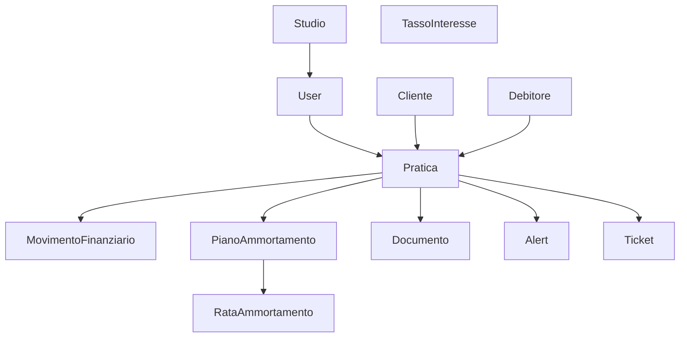

# Architettura Progetto Resolv - Guida Rapida

> **Documento di riferimento per comprendere rapidamente l'architettura e i concetti chiave del progetto**
>
> Ultimo aggiornamento: Gennaio 2026

---

## 📋 Indice Rapido

1. [Overview del Progetto](#overview-del-progetto)
2. [Stack Tecnologico](#stack-tecnologico)
3. [Struttura del Progetto](#struttura-del-progetto)
4. [Database e Entità](#database-e-entità)
5. [Backend - Moduli e Servizi](#backend---moduli-e-servizi)
6. [Frontend - Pagine e Componenti](#frontend---pagine-e-componenti)
7. [Autenticazione e Autorizzazione](#autenticazione-e-autorizzazione)
8. [Convenzioni di Codice](#convenzioni-di-codice)
9. [Deployment e Docker](#deployment-e-docker)
10. [Troubleshooting Comune](#troubleshooting-comune)

---

## Overview del Progetto

**Resolv** è un gestionale per studi legali specializzato nel recupero crediti. Permette di:

- Gestire pratiche di recupero crediti
- Tracciare movimenti finanziari (capitale, interessi, anticipazioni, compensi)
- Creare piani di ammortamento con calcolo automatico interessi
- Generare report PDF per i clienti
- Sistema multi-studio con utenti condivisi
- Gestione documenti per cartella
- Alert e ticket per comunicazioni

### Modello di Business

- **Studi Legali**: possono avere più pratiche
- **Clienti**: creditori che affidano pratiche allo studio
- **Debitori**: soggetti da cui recuperare il credito
- **Pratiche**: casi di recupero credito con fasi procedurali

---

## Stack Tecnologico

### Backend
```typescript
Framework: NestJS 11.0.1
ORM: TypeORM 0.3.28
Database: MySQL 8.0
Authentication: JWT + Passport
Cache: Redis 7
Validazione: class-validator + class-transformer
PDF Generation: PDFMake + Puppeteer
Email: Nodemailer
Task Scheduling: @nestjs/schedule
Error Tracking: Sentry
```

### Frontend
```typescript
Framework: React 19 + TypeScript
Build Tool: Vite
Routing: React Router v7
Styling: Tailwind CSS 3.4.4
Charts: Recharts 3.5.1
Icons: Lucide React
State: React Context (no Redux)
```

### Infrastructure
```yaml
Container: Docker + Docker Compose
Web Server: Nginx 1.25 (frontend)
Node: 20-alpine
Ports:
  - Frontend: 5173
  - Backend: 3000
  - MySQL: 3306
  - Redis: 6379
```

---

## Struttura del Progetto

```
Resolv/
├── apps/
│   ├── backend/
│   │   ├── src/
│   │   │   ├── auth/                    # Autenticazione JWT
│   │   │   ├── users/                   # Gestione utenti
│   │   │   ├── studi/                   # Studi legali
│   │   │   ├── clienti/                 # Clienti (creditori)
│   │   │   ├── debitori/                # Debitori
│   │   │   ├── pratiche/                # Pratiche (core business)
│   │   │   ├── movimenti-finanziari/    # Movimenti economici
│   │   │   ├── rate-ammortamento/       # Piani ammortamento + tassi interesse
│   │   │   ├── documenti/               # File upload/download
│   │   │   ├── cartelle/                # Cartelle procedurali
│   │   │   ├── avvocati/                # Avvocati dello studio
│   │   │   ├── alerts/                  # Alert e scadenze
│   │   │   ├── tickets/                 # Ticket clienti
│   │   │   ├── notifications/           # Notifiche in-app
│   │   │   ├── report/                  # Generazione report
│   │   │   ├── admin/                   # Funzioni amministrative
│   │   │   ├── backup/                  # Backup/restore DB
│   │   │   └── migrations/              # Migrazioni database
│   │   ├── data-source.ts               # Config TypeORM
│   │   ├── package.json
│   │   └── Dockerfile
│   │
│   └── frontend/
│       ├── src/
│       │   ├── api/                     # API client layer
│       │   ├── components/              # Componenti riutilizzabili
│       │   ├── pages/                   # Pagine (38 totali)
│       │   ├── layout/                  # Layout (AppLayout.tsx)
│       │   ├── contexts/                # React Context (Auth, Toast)
│       │   ├── utils/                   # Utility functions
│       │   └── App.tsx                  # Router principale
│       ├── package.json
│       └── Dockerfile
│
├── docker-compose.yml                   # Dev environment
├── docker-compose.prod.yml              # Prod environment
└── README.md
```

---

## Database e Entità

### Schema Relazionale Principale



### Entità Chiave (18 totali)

#### 1. **Studio** (`studi`)
```typescript
id: uuid
nome: string
piva: string
email: string
pec: string
telefono: string
indirizzo: string
logo: string (path)
softDelete: boolean
```

#### 2. **User** (`users`)
```typescript
id: uuid
email: string (unique)
password: string (hashed bcrypt)
nome: string
cognome: string
ruolo: 'admin' | 'studio' | 'cliente'
studioId: uuid (nullable per admin)
clienteId: uuid (nullable per cliente)
attivo: boolean
```

#### 3. **Cliente** (`clienti`)
```typescript
id: uuid
studioId: uuid
tipoSoggetto: 'persona_fisica' | 'persona_giuridica'
// Persona fisica
nome: string
cognome: string
codiceFiscale: string
// Persona giuridica
ragioneSociale: string
partitaIva: string
// Comune
email: string
telefono: string
indirizzo: string
note: text
```

#### 4. **Debitore** (`debitori`)
```typescript
// Stessa struttura di Cliente
// Relazione many-to-many con Cliente tramite cliente_debitore
```

#### 5. **Pratica** (`pratiche`) - **ENTITÀ CENTRALE**
```typescript
id: uuid
numeroPratica: string (progressivo annuale, es: "01/2026")
studioId: uuid
clienteId: uuid
debitoreId: uuid
fase: enum (11 fasi: APERTURA → CHIUSURA)
statoPratica: 'aperta' | 'chiusa' | 'sospesa'
dataApertura: date
dataAffidamento: date
dataChiusura: date (nullable)
capitaleOriginario: decimal(12,2)
avvocatoId: uuid (nullable)
collaboratoreId: uuid (nullable)
notePratica: text
noteFase: text (resettate al cambio fase)
```

**11 Fasi Procedurali:**
1. APERTURA_PRATICA
2. VERIFICA_PRELIMINARE
3. TENTATIVO_BONARIO
4. MESSA_IN_MORA
5. PREDISPOSIZIONE_ATTI
6. DECRETO_INGIUNTIVO
7. ESECUZIONE_FORZATA
8. PIGNORAMENTO
9. VENDITA_BENI
10. TRANSAZIONE
11. CHIUSURA_PRATICA

#### 6. **MovimentoFinanziario** (`movimenti_finanziari`)
```typescript
id: uuid
praticaId: uuid
tipo: enum [
  'capitale',              // Capitale originario
  'interessi',             // Interessi maturati
  'compensi',              // Compensi legali
  'anticipazioni',         // Anticipazioni studio
  'altro',                 // Altri importi
  'recupero_capitale',     // Recupero da debitore
  'recupero_interessi',
  'recupero_compensi',
  'recupero_anticipazioni',
  'altro_recupero'
]
importo: decimal(12,2)
data: date
descrizione: text
riferimento: string (es: "Fattura 123")
// Fatturazione
daFatturare: boolean
giaFatturato: boolean
dataFatturazione: date (nullable)
```

#### 7. **TassoInteresse** (`tasso_interesse`)
```typescript
id: uuid
tipo: 'legale' | 'moratorio'
tassoPercentuale: decimal(5,2)
dataInizioValidita: date
dataFineValidita: date (nullable)
decretoRiferimento: string
note: text
```

**Formula Calcolo:**
```
Interesse Semplice: I = C × S × N / 36500
- C: Capitale
- S: Tasso percentuale annuale
- N: Numero giorni (anno civile 365)
```

#### 8. **PianoAmmortamento** (`piano_ammortamento`)
```typescript
id: uuid
praticaId: uuid (unique - un piano per pratica)
capitaleIniziale: decimal(12,2)
numeroRate: integer
importoRata: decimal(12,2)
dataInizio: date
stato: 'attivo' | 'completato' | 'annullato'
// Interessi
applicaInteressi: boolean
tipoInteresse: 'legale' | 'moratorio' | 'fisso'
tassoInteresse: decimal(5,2)
capitalizzazione: 'nessuna' | 'trimestrale' | 'semestrale' | 'annuale'
dataInizioInteressi: date
totaleInteressi: decimal(12,2)
// Chiusura
esitoChiusura: 'positivo' | 'negativo' (nullable)
dataChiusura: date (nullable)
importoRecuperato: decimal(12,2)
```

#### 9. **RataAmmortamento** (`rata_ammortamento`)
```typescript
id: uuid
pianoId: uuid
numeroRata: integer
importo: decimal(12,2)
quotaCapitale: decimal(12,2)
quotaInteressi: decimal(12,2)
dataScadenza: date
pagata: boolean
dataPagamento: date (nullable)
```

#### 10. **Documento** (`documenti`)
```typescript
id: uuid
praticaId: uuid
cartellaId: uuid (FK a cartella)
nome: string
originalName: string
mimetype: string
dimensione: integer (bytes)
path: string (storage path)
uploadedBy: uuid (FK a user)
```

#### 11. **Cartella** (`cartelle`)
```typescript
id: uuid
nome: string [
  'Cliente',           // Upload solo da cliente
  'Atti',
  'Corrispondenza',
  'Sentenze',
  'Fatture',
  'Pec',
  'Varie'
]
praticaId: uuid
```

#### 12. **Alert** (`alerts`)
```typescript
id: uuid
praticaId: uuid
titolo: string
descrizione: text
dataScadenza: date
completato: boolean
creatoBy: uuid (FK user)
```

#### 13. **Ticket** (`tickets`)
```typescript
id: uuid
praticaId: uuid
oggettoRichiesta: string
messaggioCliente: text
stato: 'aperto' | 'in_lavorazione' | 'chiuso'
priorita: 'bassa' | 'media' | 'alta'
rispostaStudio: text (nullable)
apertoBy: uuid (FK user - cliente)
gestito Da: uuid (FK user - studio)
```

#### 14. **Notification** (`notifications`)
```typescript
id: uuid
userId: uuid
praticaId: uuid (nullable)
type: string (es: 'pratica_status_changed')
title: string
message: text
metadata: json
readAt: timestamp (nullable)
```

#### 15. **AuditLog** (`audit_logs`)
```typescript
id: uuid
userId: uuid
action: string (es: 'CREATE_PRATICA')
entity: string (es: 'Pratica')
entityId: string
changes: json
ipAddress: string
userAgent: string
```

---

## Backend - Moduli e Servizi

### Architettura Modulare NestJS

Ogni dominio è un **modulo NestJS** con:
- **Entity**: definizione TypeORM
- **DTO**: validazione input/output (class-validator)
- **Service**: business logic
- **Controller**: endpoint REST
- **Guards**: autorizzazione

### Pattern Comuni

#### 1. **Service Layer**
```typescript
@Injectable()
export class PraticheService {
  constructor(
    @InjectRepository(Pratica)
    private praticheRepository: Repository<Pratica>,
  ) {}

  async create(dto: CreatePraticaDto): Promise<Pratica> {
    const pratica = this.praticheRepository.create(dto);
    return await this.praticheRepository.save(pratica);
  }

  async findAll(filters: FilterDto): Promise<Pratica[]> {
    const query = this.praticheRepository.createQueryBuilder('pratica');
    // Applicare filtri...
    return await query.getMany();
  }
}
```

#### 2. **Controller Layer**
```typescript
@Controller('pratiche')
@UseGuards(JwtAuthGuard) // Autenticazione richiesta
export class PraticheController {
  constructor(private readonly praticheService: PraticheService) {}

  @Post()
  @UseGuards(AdminGuard) // Solo admin/studio
  create(@Body() dto: CreatePraticaDto) {
    return this.praticheService.create(dto);
  }

  @Get()
  findAll(@Query() filters: FilterDto) {
    return this.praticheService.findAll(filters);
  }
}
```

#### 3. **DTO Layer**
```typescript
export class CreatePraticaDto {
  @IsString()
  @IsNotEmpty()
  numeroPratica: string;

  @IsUUID()
  clienteId: string;

  @IsUUID()
  debitoreId: string;

  @IsNumber()
  @Min(0)
  capitaleOriginario: number;

  @IsOptional()
  @IsString()
  notePratica?: string;
}
```

### Moduli Speciali

#### **RateAmmortamentoModule**
```typescript
// Gestisce piani di ammortamento E tassi di interesse
Entities: [PianoAmmortamento, RataAmmortamento, TassoInteresse]
Services: [PianoAmmortamentoService, TassiInteresseService]
Controllers: [PianoAmmortamentoController, TassiInteresseController]

// Calcoli chiave
- calcolaRateConInteressi(): genera rate con quota capitale + interessi
- calcolaRateSenzaInteressi(): genera rate solo capitale
- chiudiPiano(): chiude piano e crea movimento recupero
- generaReportPiano(): PDF piano ammortamento
```

#### **ReportModule**
```typescript
// Genera report PDF per clienti
Services: [ReportService]
Controllers: [ReportController]

// Funzionalità
- Anteprima report configurabile (selezione sezioni)
- Export PDF con header/footer personalizzati
- Report fatturazione (movimenti da fatturare)
- Salvataggio report per storico
```

#### **BackupModule**
```typescript
// Backup/Restore database MySQL
Services: [BackupService]
Controllers: [BackupController]

// Funzionalità
- Backup automatico (max 30 backup)
- Download backup come .sql
- Restore da file
- Pulizia automatica vecchi backup
```

---

## Frontend - Pagine e Componenti

### Routing (React Router v7)

```typescript
// apps/frontend/src/App.tsx
<Routes>
  <Route path="/login" element={<LoginPage />} />
  <Route path="/reset-password" element={<ResetPasswordPage />} />
  <Route path="/select-studio" element={<SelectStudioPage />} />

  <Route path="/*" element={<ProtectedRoute><AppLayout>...
    <Route path="/" element={<DashboardPage />} />
    <Route path="/clienti" element={<ClientiPage />} />
    <Route path="/debitori" element={<DebitoriPage />} />
    <Route path="/pratiche" element={<PratichePage />} />
    <Route path="/pratiche/:id" element={<PraticaDetailPage />} />
    <Route path="/alert" element={<AlertsPage />} />
    <Route path="/ticket" element={<TicketsPage />} />
    <Route path="/statistiche" element={<StatistichePage />} />
    <Route path="/ricerca" element={<RicercaPage />} />
    <Route path="/report/fatturazione" element={<ReportFatturazionePage />} />

    // Admin
    <Route path="/admin/dashboard" element={<AdminDashboardPage />} />
    <Route path="/admin/users" element={<AdminUsersPage />} />
    <Route path="/admin/studi" element={<StudiPage />} />
    <Route path="/admin/tassi-interesse" element={<TassiInteressePage />} />
    <Route path="/admin/backup" element={<BackupPage />} />
    // ... altri admin
  />
</Routes>
```

### AppLayout Struttura

```typescript
// apps/frontend/src/layout/AppLayout.tsx
<div className="layout">
  {/* Sidebar sinistra */}
  <nav className="sidebar">
    {/* Navigation principale */}
    mainNav: [Dashboard, Clienti, Debitori, Pratiche, Alert, Ticket, Statistiche, Ricerca, Utilità]

    {/* Navigation studio */}
    studioNav: [Gestione Studio, Avvocati, Collaboratori, Fatturazione]

    {/* Admin (se ruolo = admin) */}
    adminNav: [Dashboard, Users, Studi, Maintenance, Audit, Export, Import, Backup, Tassi Interesse]
  </nav>

  {/* Header top */}
  <header>
    {/* Statistiche globali (pratiche aperte, scadenze oggi) */}
    {/* Campanella notifiche */}
    {/* User menu */}
  </header>

  {/* Content area */}
  <main>{children}</main>
</div>
```

### Pattern UI Comuni

#### **Lista con Filtri**
```typescript
// Esempio: PratichePage.tsx
const [pratiche, setPratiche] = useState<Pratica[]>([]);
const [filters, setFilters] = useState({
  search: '',
  fase: 'all',
  stato: 'all',
  cliente: '',
});

useEffect(() => {
  loadPratiche();
}, [filters]);

// Render
<>
  <FilterBar filters={filters} onChange={setFilters} />
  <PraticheTable data={pratiche} />
  <Pagination />
</>
```

#### **Form Modale**
```typescript
// Esempio: Creazione pratica
const [showModal, setShowModal] = useState(false);
const [formData, setFormData] = useState<CreatePraticaDto>({...});

const handleSubmit = async (e: React.FormEvent) => {
  e.preventDefault();
  try {
    await praticheApi.create(formData);
    setShowModal(false);
    loadPratiche();
  } catch (error) {
    showToast('Errore', 'error');
  }
};

<Modal show={showModal} onClose={() => setShowModal(false)}>
  <form onSubmit={handleSubmit}>
    {/* Fields */}
    <button type="submit">Salva</button>
  </form>
</Modal>
```

#### **Dettaglio con Tab**
```typescript
// Esempio: PraticaDetailPage.tsx
const [activeTab, setActiveTab] = useState('panoramica');

<Tabs value={activeTab} onChange={setActiveTab}>
  <Tab value="panoramica">Panoramica</Tab>
  <Tab value="movimenti">Movimenti</Tab>
  <Tab value="documenti">Documenti</Tab>
  <Tab value="piano">Piano Ammortamento</Tab>
  <Tab value="alert">Alert</Tab>
  <Tab value="storico">Storico</Tab>
</Tabs>

{activeTab === 'panoramica' && <PanoramicaTab />}
{activeTab === 'movimenti' && <MovimentiTab />}
// ...
```

### API Client Layer

```typescript
// apps/frontend/src/api/config.ts
const API_BASE_URL = import.meta.env.VITE_API_URL || 'http://localhost:3000';

export const api = {
  async get<T>(endpoint: string): Promise<T> {
    const token = localStorage.getItem('token');
    const response = await fetch(`${API_BASE_URL}${endpoint}`, {
      headers: {
        'Authorization': `Bearer ${token}`,
      },
    });
    return response.json();
  },

  async post<T>(endpoint: string, data: any): Promise<T> {
    const token = localStorage.getItem('token');
    const response = await fetch(`${API_BASE_URL}${endpoint}`, {
      method: 'POST',
      headers: {
        'Content-Type': 'application/json',
        'Authorization': `Bearer ${token}`,
      },
      body: JSON.stringify(data),
    });
    return response.json();
  },
  // ... patch, delete
};
```

```typescript
// apps/frontend/src/api/pratiche.ts
export const praticheApi = {
  getAll: () => api.get<Pratica[]>('/pratiche'),
  getById: (id: string) => api.get<Pratica>(`/pratiche/${id}`),
  create: (dto: CreatePraticaDto) => api.post<Pratica>('/pratiche', dto),
  update: (id: string, dto: UpdatePraticaDto) => api.patch<Pratica>(`/pratiche/${id}`, dto),
  delete: (id: string) => api.delete(`/pratiche/${id}`),
  avanzaFase: (id: string, nuovaFase: string) => api.patch(`/pratiche/${id}/fase`, { nuovaFase }),
};
```

### Componenti Riutilizzabili

```typescript
// apps/frontend/src/components/

// UI Base
- Button.tsx
- Input.tsx
- Select.tsx (CustomSelect)
- Modal.tsx
- Table.tsx
- Pagination.tsx
- Tabs.tsx
- Badge.tsx
- Card.tsx

// Business
- PraticaCard.tsx          // Card pratica nella lista
- PianoAmmortamento.tsx    // Gestione piano completo
- TassiStoricoChart.tsx    // Grafico andamento tassi
- DocumentiUpload.tsx      // Upload con drag&drop
- MovimentiTable.tsx       // Tabella movimenti finanziari
- FaseTimeline.tsx         // Timeline fasi pratica

// Layout
- ErrorBoundary.tsx
- PageLoader.tsx
- ToastProvider.tsx
- ConfirmDialog.tsx
```

---

## Autenticazione e Autorizzazione

### Flow Autenticazione JWT

```typescript
// 1. Login
POST /auth/login
Body: { email, password }
Response: { accessToken, user: { id, email, nome, cognome, ruolo, studioId, clienteId } }

// 2. Storage token
localStorage.setItem('token', accessToken);
localStorage.setItem('user', JSON.stringify(user));

// 3. Request authenticated
Headers: { Authorization: `Bearer ${token}` }

// 4. Backend validation (JwtAuthGuard)
@UseGuards(JwtAuthGuard)
@Get('protected')
getProtected(@Request() req) {
  // req.user contiene i dati decodificati dal JWT
  return req.user;
}
```

### Ruoli e Permessi

```typescript
// 3 Ruoli principali
type UserRole = 'admin' | 'studio' | 'cliente';

// Admin
- Accesso a TUTTO
- Gestione studi, utenti, backup
- Manutenzione database
- NO studioId (cross-studio)

// Studio
- Accesso solo al proprio studioId
- CRUD pratiche, clienti, debitori del proprio studio
- Gestione avvocati, collaboratori
- Report, fatturazione

// Cliente
- Accesso solo alle proprie pratiche (where clienteId = user.clienteId)
- Visualizzazione READ-ONLY
- Upload documenti nella cartella "Cliente"
- Ticket per comunicazioni con studio
```

### Guards Backend

```typescript
// JwtAuthGuard - Autenticazione base
@UseGuards(JwtAuthGuard)
@Get()
findAll() { ... }

// AdminGuard - Solo admin
@UseGuards(JwtAuthGuard, AdminGuard)
@Post('admin-only')
createAdmin() { ... }

// StudioGuard - Admin o studio proprietario
@UseGuards(JwtAuthGuard, StudioGuard)
@Get('studio/:studioId/pratiche')
getPraticheStudio(@Param('studioId') studioId: string, @Request() req) {
  // StudioGuard verifica: req.user.studioId === studioId || req.user.ruolo === 'admin'
}

// ClienteGuard - Cliente può vedere solo sue pratiche
@UseGuards(JwtAuthGuard, ClienteGuard)
@Get('pratiche/:id/cliente')
getPraticaCliente(@Param('id') id: string, @Request() req) {
  // ClienteGuard verifica: pratica.clienteId === req.user.clienteId
}
```

### Frontend Protected Routes

```typescript
// components/ProtectedRoute.tsx
export function ProtectedRoute({ children }: { children: ReactNode }) {
  const { user, loading } = useAuth();

  if (loading) return <PageLoader />;
  if (!user) return <Navigate to="/login" />;

  return <>{children}</>;
}

// Uso
<Route path="/admin/*" element={
  <ProtectedRoute requiredRole="admin">
    <AdminDashboard />
  </ProtectedRoute>
} />
```

---

## Convenzioni di Codice

### Naming

#### **Database**
- Tabelle: snake_case plurale (es: `pratiche`, `movimenti_finanziari`)
- Colonne: camelCase nel codice, snake_case in DB (TypeORM converte)
- FK: `{entità}Id` (es: `praticaId`, `studioId`)

#### **TypeScript**
- Classi/Interfaces: PascalCase (es: `Pratica`, `CreatePraticaDto`)
- Variabili/Functions: camelCase (es: `getPratiche`, `totalePagato`)
- Constants: UPPER_SNAKE_CASE (es: `API_BASE_URL`)
- Enums: PascalCase (es: `UserRole`, `StatoPratica`)

#### **Files**
- Components: PascalCase (es: `PraticaCard.tsx`)
- Services: kebab-case (es: `pratiche.service.ts`)
- API clients: kebab-case (es: `pratiche.ts` in api/)
- Pages: PascalCase + "Page" (es: `DashboardPage.tsx`)

### Struttura DTO

```typescript
// CREATE DTO - tutti i campi obbligatori/opzionali
export class CreatePraticaDto {
  @IsString()
  numeroPratica: string;

  @IsUUID()
  clienteId: string;

  @IsOptional()
  @IsString()
  notePratica?: string;
}

// UPDATE DTO - tutti i campi opzionali
export class UpdatePraticaDto {
  @IsOptional()
  @IsString()
  numeroPratica?: string;

  @IsOptional()
  @IsUUID()
  avvocatoId?: string;
}

// FILTER/QUERY DTO
export class FilterPraticheDto {
  @IsOptional()
  @IsString()
  search?: string;

  @IsOptional()
  @IsEnum(FasePratica)
  fase?: FasePratica;

  @IsOptional()
  @IsInt()
  @Min(1)
  page?: number = 1;

  @IsOptional()
  @IsInt()
  @Min(1)
  @Max(100)
  limit?: number = 20;
}
```

### Error Handling

#### **Backend**
```typescript
// Usare eccezioni NestJS built-in
throw new NotFoundException('Pratica non trovata');
throw new BadRequestException('Dati non validi');
throw new UnauthorizedException('Token non valido');
throw new ForbiddenException('Accesso negato');

// Custom exception filter (già configurato)
@Catch()
export class AllExceptionsFilter implements ExceptionFilter {
  catch(exception: unknown, host: ArgumentsHost) {
    // Log con Sentry
    // Risposta formatted
  }
}
```

#### **Frontend**
```typescript
// Try-catch con toast
try {
  await praticheApi.create(data);
  showToast('Pratica creata con successo', 'success');
} catch (error: any) {
  const message = error.response?.data?.message || 'Errore durante la creazione';
  showToast(message, 'error');
  console.error(error);
}
```

### Formattazione Numeri e Date

```typescript
// Backend - Decimal columns
@Column({ type: 'decimal', precision: 12, scale: 2 })
importo: number;

// Frontend - Formattazione
const formatCurrency = (value: number) =>
  new Intl.NumberFormat('it-IT', {
    style: 'currency',
    currency: 'EUR'
  }).format(value);

const formatDate = (dateString: string) =>
  new Date(dateString).toLocaleDateString('it-IT', {
    day: '2-digit',
    month: '2-digit',
    year: 'numeric'
  });

const formatNumber = (value: number) =>
  new Intl.NumberFormat('it-IT', {
    minimumFractionDigits: 2,
    maximumFractionDigits: 2
  }).format(value);
```

---

## Deployment e Docker

### Docker Compose Services

```yaml
services:
  # Database
  mysql:
    image: mysql:8.0
    environment:
      MYSQL_ROOT_PASSWORD: ${DB_ROOT_PASSWORD}
      MYSQL_DATABASE: recupero_crediti
      MYSQL_USER: ${DB_USER}
      MYSQL_PASSWORD: ${DB_PASSWORD}
    volumes:
      - mysql_data:/var/lib/mysql
    ports:
      - "3306:3306"
    healthcheck:
      test: ["CMD", "mysqladmin", "ping", "-h", "localhost"]
      interval: 10s
      timeout: 5s
      retries: 5

  # Cache
  redis:
    image: redis:7-alpine
    ports:
      - "6379:6379"
    healthcheck:
      test: ["CMD", "redis-cli", "ping"]
      interval: 10s
      timeout: 3s
      retries: 3

  # Backend
  backend:
    build:
      context: ./apps/backend
      dockerfile: Dockerfile
    environment:
      NODE_ENV: ${NODE_ENV}
      DB_HOST: mysql
      DB_PORT: 3306
      DB_USER: ${DB_USER}
      DB_PASSWORD: ${DB_PASSWORD}
      DB_NAME: recupero_crediti
      REDIS_HOST: redis
      REDIS_PORT: 6379
      JWT_SECRET: ${JWT_SECRET}
      JWT_EXPIRES_IN: 7d
    ports:
      - "3000:3000"
    depends_on:
      mysql:
        condition: service_healthy
      redis:
        condition: service_healthy
    volumes:
      - ./uploads:/usr/src/app/uploads
      - ./backups:/usr/src/app/backups

  # Frontend
  frontend:
    build:
      context: ./apps/frontend
      dockerfile: Dockerfile
    environment:
      VITE_API_URL: http://localhost:3000
    ports:
      - "5173:80"
    depends_on:
      - backend
```

### Build & Deploy

```bash
# Sviluppo
docker compose up -d

# Produzione
docker compose -f docker-compose.prod.yml up -d --build

# Rebuild dopo modifiche
docker compose build
docker compose up -d

# Logs
docker compose logs -f backend
docker compose logs -f frontend

# Stop
docker compose down

# Stop + rimuovi volumi (ATTENZIONE: cancella DB!)
docker compose down -v
```

### Migrations

```bash
# Generare migration da modifiche entity
cd apps/backend
npm run migration:generate -- src/migrations/NomeMigration

# Eseguire migrations pending
npm run migration:run

# Revert ultima migration
npm run migration:revert

# In Docker container
docker compose exec backend npm run migration:run
```

### Environment Variables

```env
# .env (root del progetto)
NODE_ENV=development
DB_HOST=localhost
DB_PORT=3306
DB_USER=resolv_user
DB_PASSWORD=secure_password_here
DB_ROOT_PASSWORD=root_password_here
DB_NAME=recupero_crediti

JWT_SECRET=your_jwt_secret_key_here
JWT_EXPIRES_IN=7d

REDIS_HOST=localhost
REDIS_PORT=6379

# Email (opzionale)
SMTP_HOST=smtp.example.com
SMTP_PORT=587
SMTP_USER=noreply@resolv.it
SMTP_PASS=password

# Frontend
VITE_API_URL=http://localhost:3000

# Sentry (opzionale)
SENTRY_DSN=https://...
```

---

## Troubleshooting Comune

### 1. **Backend non si avvia**

#### Problema: `ECONNREFUSED mysql:3306`
**Soluzione:**
```bash
# Verifica che MySQL sia healthy
docker compose ps

# Se non è healthy, riavvia
docker compose restart mysql

# Controlla logs MySQL
docker compose logs mysql
```

#### Problema: `Migration failed: Table already exists`
**Soluzione:**
```bash
# Revert e riprova
docker compose exec backend npm run migration:revert
docker compose exec backend npm run migration:run

# Oppure resetta DB (ATTENZIONE: cancella dati!)
docker compose down -v
docker compose up -d
```

#### Problema: `Cannot find module '@nestjs/axios'`
**Soluzione:**
```bash
# Reinstalla dipendenze nel container
docker compose exec backend npm install --legacy-peer-deps

# Oppure rebuild
docker compose build backend
docker compose up -d backend
```

### 2. **Frontend non si compila**

#### Problema: `TypeScript error: Property 'xxx' does not exist`
**Soluzione:**
```typescript
// Verifica che le interfacce API siano allineate con il backend
// File: apps/frontend/src/api/{modulo}.ts

// Se l'entity backend ha cambiato i nomi dei campi,
// aggiorna l'interfaccia frontend corrispondente
```

#### Problema: `Module not found: Can't resolve 'xxx'`
**Soluzione:**
```bash
cd apps/frontend
npm install

# Se persiste, pulisci cache
rm -rf node_modules package-lock.json
npm install
```

### 3. **CORS Errors**

#### Problema: `Access-Control-Allow-Origin`
**Soluzione:**
```typescript
// apps/backend/src/main.ts
app.enableCors({
  origin: [
    'http://localhost:5173',  // Dev frontend
    'http://localhost:3001',  // Alternative port
    'https://yourdomain.com', // Production
  ],
  credentials: true,
});
```

### 4. **Autenticazione non funziona**

#### Problema: `401 Unauthorized` su tutte le richieste
**Soluzione:**
```typescript
// Verifica che il token sia salvato
localStorage.getItem('token'); // deve esistere

// Verifica che sia incluso nelle richieste
// apps/frontend/src/api/config.ts
headers: {
  'Authorization': `Bearer ${localStorage.getItem('token')}`
}

// Verifica che JWT_SECRET sia lo stesso in .env
```

### 5. **Performance Lenta**

#### Problema: Query lente
**Soluzione:**
```typescript
// Aggiungi relazioni eager o usa query builder con leftJoinAndSelect

// Prima (N+1 query)
const pratiche = await this.praticheRepository.find();
for (const p of pratiche) {
  p.cliente = await this.clientiRepository.findOne(p.clienteId);
}

// Dopo (1 query)
const pratiche = await this.praticheRepository.find({
  relations: ['cliente', 'debitore', 'avvocato'],
});

// Oppure con query builder
const pratiche = await this.praticheRepository
  .createQueryBuilder('pratica')
  .leftJoinAndSelect('pratica.cliente', 'cliente')
  .leftJoinAndSelect('pratica.debitore', 'debitore')
  .getMany();
```

### 6. **Upload Files Fails**

#### Problema: `File too large` o `413 Entity Too Large`
**Soluzione:**
```typescript
// apps/backend/src/main.ts
app.use(json({ limit: '50mb' }));
app.use(urlencoded({ limit: '50mb', extended: true }));

// Nginx (se presente)
// nginx.conf
client_max_body_size 50M;
```

### 7. **Redis Connection Error**

#### Problema: `ECONNREFUSED redis:6379`
**Soluzione:**
```bash
# Verifica Redis
docker compose ps redis

# Se non gira, avvia
docker compose up -d redis

# Se l'app non usa Redis (cache/rate limiting opzionali),
# puoi disabilitarlo temporaneamente commentando in app.module.ts
```

---

## Quick Commands Cheat Sheet

```bash
# === DOCKER ===
docker compose up -d                    # Avvia tutti i servizi
docker compose down                     # Ferma tutti i servizi
docker compose logs -f backend          # Logs backend in tempo reale
docker compose exec backend sh          # Shell nel container backend
docker compose ps                       # Status containers
docker compose build --no-cache         # Rebuild forzato

# === DATABASE ===
# Accedi a MySQL
docker compose exec mysql mysql -u root -p
# oppure
docker compose exec mysql mysql -u resolv_user -p recupero_crediti

# Backup
docker compose exec mysql mysqldump -u root -p recupero_crediti > backup.sql

# Restore
docker compose exec -T mysql mysql -u root -p recupero_crediti < backup.sql

# === MIGRATIONS ===
cd apps/backend
npm run migration:generate -- src/migrations/NomeMigration
npm run migration:run
npm run migration:revert

# In Docker
docker compose exec backend npm run migration:run

# === TESTING ===
# Backend tests
cd apps/backend
npm test
npm run test:e2e
npm run test:cov

# Frontend tests
cd apps/frontend
npm test

# === BUILD ===
# Backend
cd apps/backend
npm run build
npm run start:prod

# Frontend
cd apps/frontend
npm run build
npm run preview

# === LINTING ===
npm run lint
npm run format

# === SEED DATA ===
# Crea admin di default
docker compose exec backend npm run seed:admin
```

---

## Checklist Nuove Feature

Quando aggiungi una nuova feature, segui questo processo:

### Backend

- [ ] **1. Entity**
  - [ ] Crea `{nome}.entity.ts` con decorators TypeORM
  - [ ] Definisci colonne, relazioni, validazioni
  - [ ] Aggiungi index se necessario

- [ ] **2. DTO**
  - [ ] `create-{nome}.dto.ts` con validazioni class-validator
  - [ ] `update-{nome}.dto.ts` (tutti campi opzionali)
  - [ ] `filter-{nome}.dto.ts` se serve ricerca/filtri

- [ ] **3. Service**
  - [ ] CRUD base: `create`, `findAll`, `findOne`, `update`, `remove`
  - [ ] Business logic specifica
  - [ ] Gestione errori con exceptions NestJS

- [ ] **4. Controller**
  - [ ] Endpoint REST con verbi HTTP corretti
  - [ ] Guards appropriati (JwtAuthGuard, AdminGuard, etc.)
  - [ ] Swagger decorators (opzionale)

- [ ] **5. Module**
  - [ ] Registra entity in `TypeOrmModule.forFeature([])`
  - [ ] Registra service in `providers`
  - [ ] Registra controller in `controllers`
  - [ ] Export service se usato da altri moduli

- [ ] **6. Migration**
  - [ ] Genera: `npm run migration:generate`
  - [ ] Testa: `npm run migration:run`
  - [ ] Committare migration file

- [ ] **7. Tests** (opzionale ma consigliato)
  - [ ] Unit tests per service
  - [ ] E2E tests per endpoints

### Frontend

- [ ] **1. API Client**
  - [ ] Crea `{nome}.ts` in `src/api/`
  - [ ] Definisci interfacce TypeScript
  - [ ] Implementa funzioni API (get, post, patch, delete)

- [ ] **2. Componente/Pagina**
  - [ ] Crea componente in `src/components/` o pagina in `src/pages/`
  - [ ] Implementa UI con Tailwind
  - [ ] Gestisci stato (useState, useEffect)
  - [ ] Gestisci errors con try-catch + toast

- [ ] **3. Routing**
  - [ ] Aggiungi route in `App.tsx`
  - [ ] Aggiungi link in `AppLayout.tsx` (sidebar)
  - [ ] Proteggi route se necessario (ProtectedRoute)

- [ ] **4. Validazione Form**
  - [ ] Validazione client-side prima dell'invio
  - [ ] Feedback errori inline
  - [ ] Disabled button durante submit

- [ ] **5. Test Integrazione**
  - [ ] Testa CRUD completo
  - [ ] Testa con permessi diversi (admin, studio, cliente)
  - [ ] Testa edge cases

### Documentazione

- [ ] **1. Aggiorna README**
  - [ ] Descrivi nuova feature
  - [ ] Aggiungi esempi API se rilevanti

- [ ] **2. Aggiorna ARCHITETTURA_PROGETTO.md** (questo file)
  - [ ] Aggiungi entity in sezione Database
  - [ ] Aggiungi API endpoints
  - [ ] Nota pattern speciali se usati

- [ ] **3. Commit Message**
  - [ ] Usa conventional commits: `feat(module): descrizione`
  - [ ] Esempio: `feat(tassi-interesse): add interest rates management`

---

## Note Finali

### Performance Tips

1. **Database**:
   - Usa index su colonne filtrate frequentemente (es: `praticaId`, `clienteId`)
   - Evita `SELECT *`, specifica colonne necessarie
   - Usa `relations: []` solo quando serve, altrimenti lazy loading

2. **Frontend**:
   - Usa `useMemo` per calcoli pesanti
   - Usa `useCallback` per funzioni passate come props
   - Lazy load pagine pesanti (`React.lazy()`)
   - Paginazione per liste lunghe (max 50 items per pagina)

3. **API**:
   - Implementa cache Redis per dati statici (es: lista studi)
   - Rate limiting per prevenire abusi
   - Compression delle risposte (gzip)

### Security Best Practices

1. **Backend**:
   - SEMPRE validare input con class-validator
   - SEMPRE usare JwtAuthGuard per endpoint protetti
   - SEMPRE fare sanitize di user input in query raw
   - Hash passwords con bcrypt (cost factor 10)
   - JWT expiration: 7 giorni (refresh token se serve durata maggiore)

2. **Frontend**:
   - NON salvare dati sensibili in localStorage (solo token JWT)
   - Escape user input in HTML (React lo fa automaticamente)
   - HTTPS in produzione
   - Content Security Policy headers

3. **Database**:
   - Usa user MySQL con permessi limitati (NO root in prod)
   - Backup automatici giornalieri
   - Encrypt backup files se contengono dati sensibili

### Contatti e Risorse

- **Documentazione NestJS**: https://docs.nestjs.com/
- **Documentazione React**: https://react.dev/
- **TypeORM**: https://typeorm.io/
- **Tailwind CSS**: https://tailwindcss.com/docs

---

**Versione Documento**: 1.0.0
**Data Ultimo Aggiornamento**: 09 Gennaio 2026
**Autore**: Sistema Resolv Development Team

